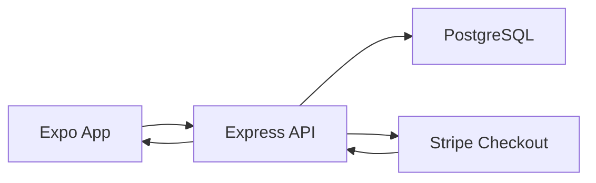

# System Architecture

## Overview

The project uses a three-layer architecture:

1. **Frontend** — Expo / React Native app for buyers, farmers, and admins.
2. **Backend** — Express API for authentication, catalogue management, orders, reviews, analytics, and payments.
3. **Database** — PostgreSQL for persistent storage, designed to run in pgAdmin4 locally or Neon in production.

## Flow

## Main Modules

- `App.js` — role-based navigation and shell
- `src/screens/` — UI screens for auth, marketplace, seller dashboard, orders, admin, and profile
- `src/context/MarketplaceContext.js` — session state, cart, orders, notifications, and API orchestration
- `backend/src/index.js` — REST API, auth, checkout, moderation, and analytics
- `database/schema.sql` — database schema for pgAdmin4 / Neon

## Key Responsibilities

- **Frontend**
  - Responsive mobile-first commerce UI
  - Product browsing, cart management, checkout, and order history
  - Farmer listing management and admin moderation tools

- **Backend**
  - JWT authentication
  - Role-based authorization
  - Product CRUD and order lifecycle
  - Review submission and analytics aggregation
  - Stripe hosted checkout and webhook processing

- **Database**
  - Users, products, orders, reviews, payments, and audit-friendly timestamps
  - Persistent storage for production deployment

